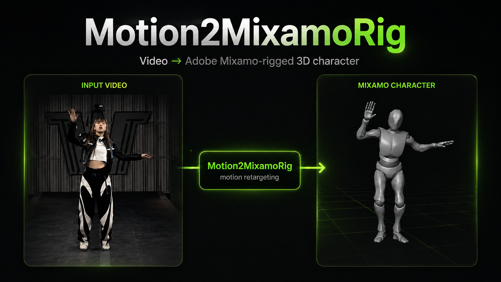

# Motion2MixamoRig



<p align="center">
  <a href="README.zh-CN.md">中文</a> · <a href="README.md">English</a> · 한국어 · <a href="README.ja.md">日本語</a> · <a href="README.de.md">Deutsch</a> · <a href="README.ru.md">Русский</a> · <a href="README.ar.md">العربية</a>
</p>

영상 속 사람의 동작을 Adobe Mixamo rig 3D 캐릭터로 옮깁니다.

게임 개발자를 위한 도구입니다. **한 사람만** 나오는 동작 영상과 Mixamo 캐릭터를 넣으면 미리보기 영상과, Blender / Unity에 바로 넣을 수 있는 스키닝된 캐릭터 파일(`.glb`)을 생성합니다.

Agent는 먼저 [`AGENTS.md`](AGENTS.md)를 읽어 주세요.

https://github.com/user-attachments/assets/37c67642-f36c-4815-bcf3-028ed9546a2f

<p align="center">
  <sub>이 저장소의 <a href="demo.mp4">demo.mp4</a>를 열어 주세요.</sub>
</p>

다른 데모:

https://github.com/user-attachments/assets/073f20c8-7283-4209-98e8-f247228bfd56

## 사전 요구 사항

Python 3.10+가 필요합니다. 클론한 뒤 가상환경을 만들고 의존성을 설치하면 `m2mr` 명령을 쓸 수 있습니다:

```bash
git clone https://github.com/MaxLiu22/Motion2MixamoRig.git
cd Motion2MixamoRig
python -m venv .venv && source .venv/bin/activate

# 의존성과 이 프로젝트를 설치합니다. chumpy(의존성 체인의 오래된 패키지)의
# 빌드 스크립트가 pip를 import하는데, pip 기본 격리 빌드에서는
# "No module named 'pip'"로 실패합니다. 격리를 끄고(--no-build-isolation)
# 먼저 설치한 뒤 이 프로젝트를 설치하세요.
pip install --upgrade pip setuptools wheel \
  && pip install "numpy>=1.26" \
  && pip install --no-build-isolation "chumpy==0.70" \
  && pip install -e .
```

추론 가중치(GVHMR 등)는 이 단계에서 받지 않습니다. 첫 `m2mr run` 때 `weights/`로 자동 다운로드됩니다(약 5 GB, 한 번만).

ffmpeg도 권장합니다(macOS: `brew install ffmpeg`, Ubuntu: `apt install ffmpeg`).
없어도 실행되지만, 출력 영상에 **소리가 없고** 브라우저에서 바로 재생되지 않습니다.

## 실행 전: `assets/`에 세 가지를 넣으세요

이 저장소는 해당 파일을 포함하지 않습니다. 직접 준비해야 합니다. SMPL-X 파일명은 아래 표와 한 글자도 같아야 합니다. FBX와 영상 이름은 상관없습니다.

| 무엇 | 어디에 | 어디서 |
|---|---|---|
| SMPL-X 바디 모델 | `assets/body_models/smplx/SMPLX_NEUTRAL.npz` | [SMPL-X](https://smpl-x.is.tue.mpg.de/)에서 등록한 뒤 다운로드 |
| Mixamo 캐릭터 FBX | `assets/mixamo/Y_Bot.fbx` | Adobe 계정으로 [Mixamo](https://www.mixamo.com)에서 Y Bot(또는 다른 Mixamo rig 캐릭터) 다운로드 |
| 동작 영상 | `assets/video/<your_clip>.mp4` | **사람 한 명만**, 잘 보이고, **머리부터 발끝까지 영상 내내 화면 안에** (여러 파일 가능, 실행마다 가장 최근에 넣은 것 사용) |

주의: Mixamo에서 받은 파일은 `Y Bot.fbx`(**공백**)이고, 표의 `Y_Bot.fbx`(**밑줄**)과 한 글자 다릅니다.
밑줄로 바꾸면 기본 rig가 되어 `m2mr run`에 `--rig` 없이 씁니다. 이름을 안 바꿔도 됩니다 — `Y_Bot.fbx`가 없으면 `assets/mixamo/`의 첫 `.fbx`를 씁니다.

`assets/video/`에는 영상을 여러 개 넣을 수 있습니다. `--video`를 지정하지 않으면 **이 폴더에 가장 마지막에 넣은** 파일을 씁니다.
각 영상에는 사람이 한 명만 나와야 하고, **머리부터 발끝까지 영상 내내 화면 안**에 있어야 하며 화면 밖으로 나가면 안 됩니다. `m2mr doctor` / `m2mr run`이 프레임을 샘플링해 두 명이 보이면 추출 전에 멈춥니다.

## 빠른 시작

결과는 `outputs/<실행시각>_<영상명>/`에 있습니다. 영상은 그 안의 `videos/`를 여세요.

### 1. 자산과 환경 확인

빠진 것은 어디서 받고 어디에 넣을지 함께 출력합니다.

```bash
m2mr doctor
```

### 2. 첫 실행: 화면에 결과 띄우기

플래그 없이 실행하면 **`assets/video/`에서 가장 최근 파일**과 `assets/mixamo/Y_Bot.fbx`를 씁니다.

```bash
m2mr run
```

이 단계가 가장 느립니다. 첫 실행은 약 5 GB 추론 가중치를 받은 뒤(한 번만) 영상에서 사람 동작을 추출합니다.
약 30초 영상은 CPU에서 추출에 대략 8–15분, 가중치가 이미 있으면 비슷한 길이에 3–5분입니다.
리타게팅과 렌더링은 보통 1–2분입니다. 다음 절의 `--skeleton`으로 스켈레톤을 재사용하면 추출을 건너뛰어 수십 초면 끝납니다.

### 3. 같은 동작, 다른 캐릭터

Mixamo에서 다른 캐릭터를 `assets/mixamo/`에 넣으세요. **`--rig`만 바꿔 다시 돌리지 마세요** — 느린 추출이 그대로 반복됩니다.
`--skeleton`으로 이전 실행의 스켈레톤을 재사용하면 몇 분이 수십 초가 됩니다:

```bash
m2mr run --skeleton outputs/<previous-run-dir>/skeleton_motion.npz --rig assets/mixamo/Vampire.fbx
```

### 4. 다른 영상

`--video`로 클립을 고릅니다. `--rig`와 자유롭게 조합됩니다.

```bash
m2mr run --video assets/video/dance.mp4 --rig assets/mixamo/Vampire.fbx
```

## 출력

각 `m2mr run`은 **명령이 시작된 시각**으로 디렉터리를 만듭니다:

```
outputs/20260829_193205_dance/
├── run.json                    # 시작 시각, 사용한 영상 / rig, 전체 명령
├── skeleton_motion.npz         # 인체 3D 스켈레톤 (rig 교체 시 재사용, 추출 생략)
├── mixamo_rotations.npz        # Mixamo 본별 회전
├── mixamo_character.glb        # 스키닝된 캐릭터 + 애니메이션, Blender / Unity에 바로 임포트
└── videos/                     # 입력 영상과 같은 화면비
    ├── human_skeleton.mp4      # 인체 스켈레톤
    ├── mixamo_skeleton.mp4     # Mixamo rig 스켈레톤
    ├── mixamo_character.mp4    # Mixamo rig 캐릭터
    └── compare.mp4             # 2×2: 원본(좌상) / Mixamo 스켈레톤(우상) / 인체 스켈레톤(좌하) / 캐릭터(우하)
```

`mixamo_character.glb`는 Blender에서 File → Import → glTF 2.0 (.glb/.gltf)로 엽니다. 카메라가 빈 곳을 보고 있으면 캐릭터를 선택한 뒤 View → Frame Selected. 머리와 손의 구체들은 메시가 아니라 본 표시입니다. Armature를 선택하고 Armature → Viewport Display에서 Shapes를 끄세요. 타임라인 끝 프레임을 클립 길이에 맞춘 뒤 재생하세요. 같은 실행의 `videos/mixamo_character.mp4`와 비교하면 됩니다.

## 라이선스

이 저장소의 코드는 Apache-2.0입니다. 직접 받은 자산은 각 조항이 있으며 이 저장소와 함께 재배포하면 안 됩니다:

- **SMPL-X**: MPI에서 배포가 제한됨. 기본은 비상업 연구 / 교육 / 예술; 상업 이용은 별도 계약
- **Mixamo FBX**: 제품에 넣어도 됨; 원본 FBX를 에셋 팩으로 재배포하면 안 됨
- **GVHMR 및 기타 추론 가중치**: 첫 `m2mr run` 때 `weights/`로 자동 다운로드, 각 업스트림 라이선스

## 문의

문제가 있으시거나, 로컬 설치에 도움이 필요하시거나, 협업을 논의하고 싶으시면 이메일로 연락해 주세요:
[maxliu2022sz@gmail.com](mailto:maxliu2022sz@gmail.com)
